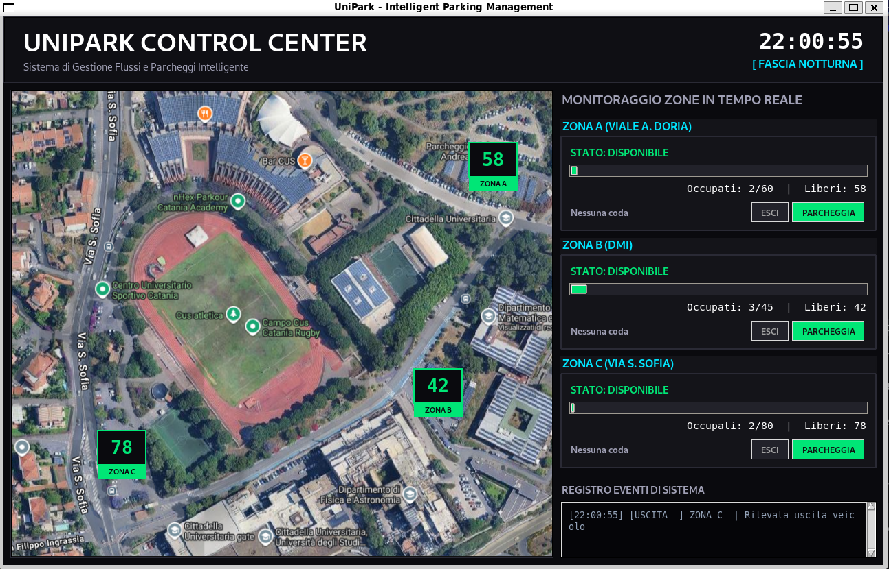

# UniPark — Simulazione e Gestione Parcheggi Universitari

> Software dimostrativo per la simulazione in tempo reale della gestione dei parcheggi della Cittadella Universitaria di Catania.

---



*L'interfaccia principale di monitoraggio con mappa satellitare interattiva, indicatori HUD in tempo reale e log degli eventi di sistema.*

##  Descrizione

**UniPark** è una demo software didattica sviluppata in Python che simula la gestione dinamica dei posti auto nelle principali zone della Cittadella Universitaria (Viale A. Doria, DMI, Via S. Sofia).

Il progetto non è collegato a sensori reali: il flusso di auto viene generato autonomamente (*Auto-Flow Generation*) per testare la logica interna. L'utente può anche interagire manualmente tramite interfaccia grafica per occupare o liberare posti.

---

##  Struttura del Progetto

```
UniPark/
├── assets/
│   ├── screenshot.png      # Anteprima del layout del programma
├── src/
│   ├── UniPark.py          # Logica core: Model (ParkingZone) + Controller (UniParkSystem)
│   └── UniparkGUI.py       # Interfaccia grafica Tkinter (Dashboard)
├── tests/                  # Unit test (pytest)
├── .github/workflows/      # Pipeline CI (GitHub Actions)
├── requirements_dev.txt    # Dipendenze di sviluppo
├── .pylintrc               # Configurazione Pylint
├── .gitignore
├── LICENSE
└── README.md
```

---

##  Funzionamento

Il sistema è diviso in due componenti principali:

**`UniPark.py` — Modello e Controller**
- `ParkingZone`: gestisce i dati di una singola zona (posti liberi, occupati, coda d'attesa). Tutte le operazioni sono **thread-safe** tramite `threading.Lock`.
- `UniParkSystem`: inizializza le tre zone di parcheggio con valori casuali e fornisce metodi di accesso al sistema.

**`UniparkGUI.py` — Interfaccia Grafica**
- Dashboard con una card per ogni zona, che mostra occupazione, progress bar colorata (verde/arancione/rosso) e coda d'attesa.
- Thread in background per ogni zona che simula il traffico automatico ogni 2-5 secondi.
- Pulsanti manuali **PARK** e **UNPARK** per interazione diretta.
- Area log con timestamp e livelli colorati (INFO, SUCCESS, WARNING, ERROR).

---

##  Zone di Parcheggio

| Zona | Capacità |
|------|----------|
| Zona A — Viale A. Doria | 60 posti |
| Zona B — DMI | 45 posti |
| Zona C — Via S. Sofia | 80 posti |

---

##  Requisiti

### Esecuzione
- **Python 3.10+**
- **Tkinter** (incluso nella libreria standard di Python)

> Non sono necessarie dipendenze esterne per eseguire il programma.

### Sviluppo
Le dipendenze di sviluppo sono elencate in `requirements_dev.txt`:

```
pytest
pytest-mock
pytest-cov
pylint
mypy
flake8
black
isort
```

---

##  Installazione e Avvio

```bash
# 1. Clona il repository
git clone https://github.com/gio24ita/UniPark.git
cd UniPark

# 2. (Opzionale) Crea e attiva un ambiente virtuale
python -m venv .venv
source .venv/bin/activate        # Linux/macOS
.venv\Scripts\activate           # Windows

# 3. Installa le dipendenze di sviluppo
pip install -r requirements_dev.txt

# 4. Avvia l'applicazione
python src/UniparkGUI.py
```

---

##  Test

```bash
# Esegui tutti i test
pytest tests/

# Con report di copertura
pytest tests/ --cov=src --cov-report=term-missing
```

---

##  Linting e Code Style

Il progetto usa **Black** come formatter e **isort** per l'ordinamento degli import:

```bash
# Formatta il codice
black src/ tests/

# Ordina gli import
isort src/ tests/

# Controlla la qualità del codice
pylint src/
flake8 src/
mypy src/
```

---

##  Pipeline CI (GitHub Actions)

Ad ogni Pull Request viene eseguita automaticamente una pipeline che effettua:
- Controllo stile con **Black** e **isort**
- Linting con **Pylint** e **Flake8**
- Type checking con **Mypy**
- Esecuzione dei **test** con **pytest**

---

##  Standard dei Commit

Il progetto segue i **Conventional Commits**:

```
feat: aggiunta nuova funzionalità
fix: correzione bug
docs: aggiornamento documentazione
test: aggiunta o modifica dei test
refactor: refactoring del codice
ci: modifiche alla pipeline
```

---

##  Autori

Progetto universitario sviluppato da Giovanni Pinelli, Liborio Pasqualino, Giovanni Tarpini e Damiano Nania per il corso **QD 2025/2026** — Università degli Studi di Catania.

---

##  Licenza

Distribuito sotto licenza **MIT**. Vedi il file [LICENSE](LICENSE) per i dettagli.
